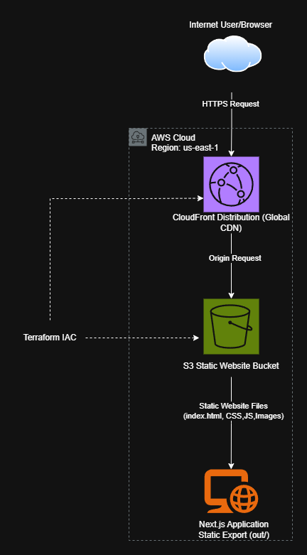

# Terraform Portfolio Project

This project demonstrates how to deploy a static Next.js website to AWS using Infrastructure as Code (IaC) with Terraform.

The application is hosted on Amazon S3 and distributed globally using Amazon CloudFront.

---

# Live Website

https://d19y7jlapazm52.cloudfront.net

---

# Architecture



---

# AWS Services Used

- Amazon S3
- Amazon CloudFront
- AWS IAM
- AWS CLI

---

# 🛠 Technologies Used

- Terraform
- Next.js
- Git
- GitHub
- AWS CLI

---

# Project Structure

```
terraform-portfolio-project/
│
├── nextjs-blog/
│   ├── app/
│   ├── public/
│   └── next.config.ts
│
├── terraform/
│   ├── providers.tf
│   ├── s3.tf
│   ├── cloudfront.tf
│   └── outputs.tf
│
├── Architecture.png
└── README.md
```

---

# Infrastructure Created

Terraform provisions the following AWS resources:

- Amazon S3 Bucket
- S3 Website Configuration
- Bucket Ownership Controls
- Public Access Configuration
- Bucket Policy
- Amazon CloudFront Distribution

---

# Deployment Process

1. Created a Next.js application.
2. Configured the application for static export.
3. Generated the production build using:

```bash
npm run build
```

4. Provisioned AWS infrastructure using Terraform.
5. Uploaded the static website to Amazon S3 using the AWS CLI.
6. Distributed the website globally with Amazon CloudFront.

---

# Lessons Learned

This project helped me gain practical experience with:

- Infrastructure as Code using Terraform
- Amazon S3 Static Website Hosting
- Amazon CloudFront
- Terraform state management
- AWS CLI
- Git and GitHub workflows
- Deploying static Next.js applications

One challenge I encountered was that portions of the original course material were written for older versions of Terraform and Next.js. I adapted the implementation to work with the latest versions while achieving the same final architecture and functionality.

---

# Loom Walkthrough

Coming Soon

---

# Future Improvements

- Purchase a custom domain
- Configure Route 53
- Add HTTPS using an ACM certificate
- Automate deployments with GitHub Actions